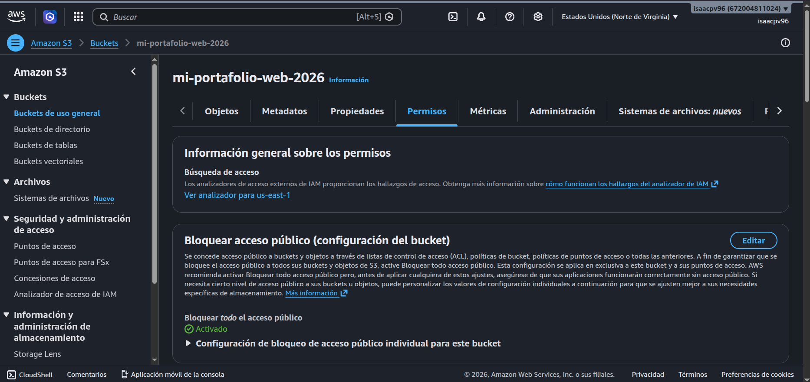
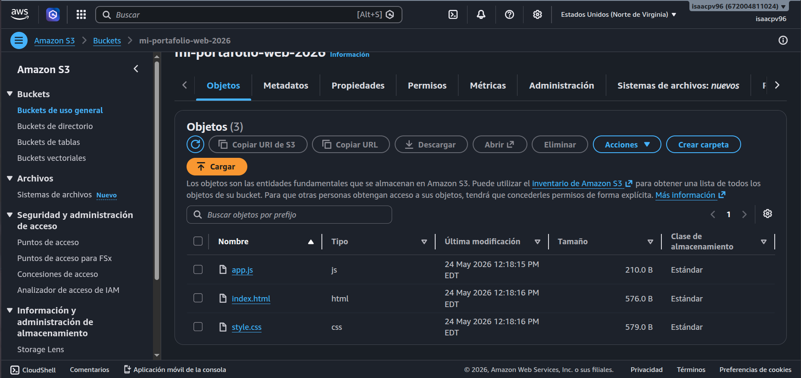
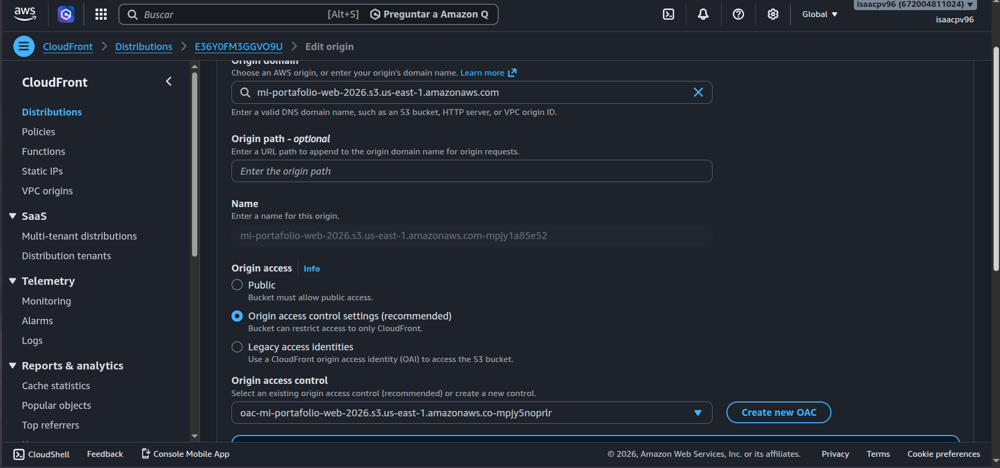
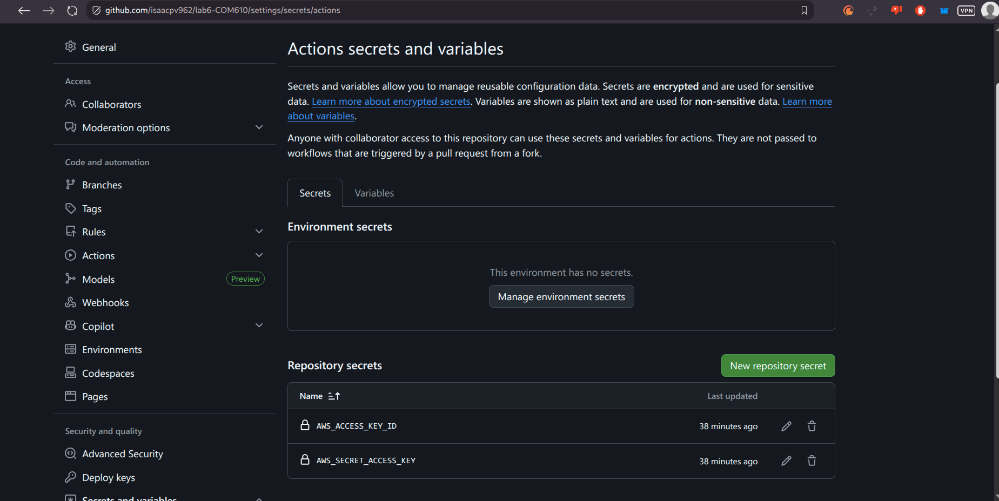
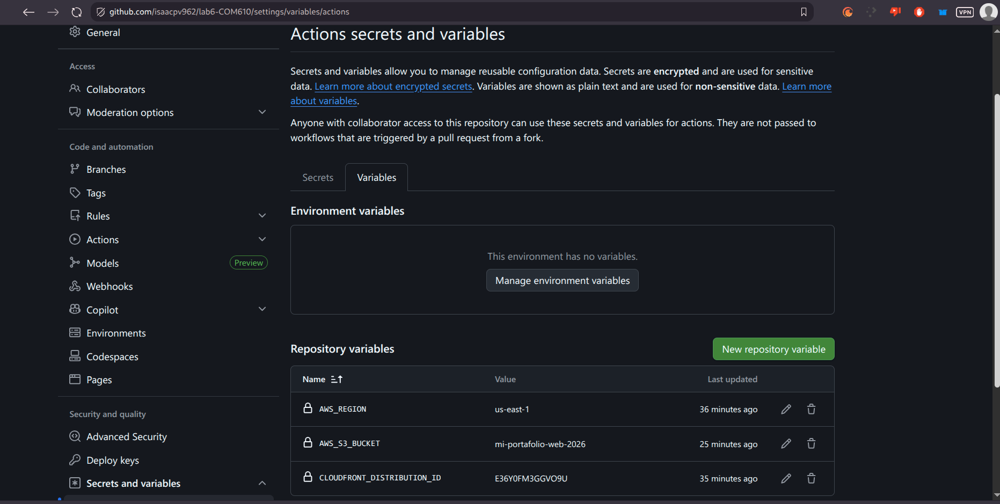
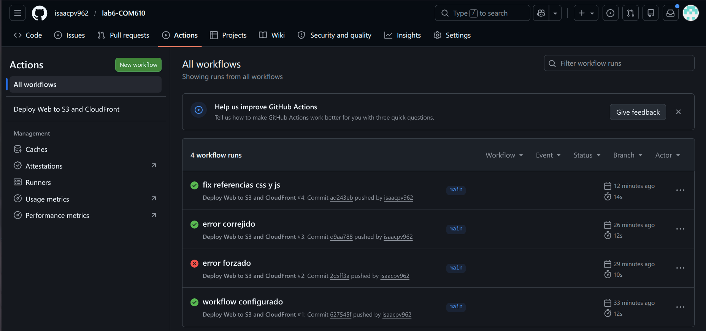
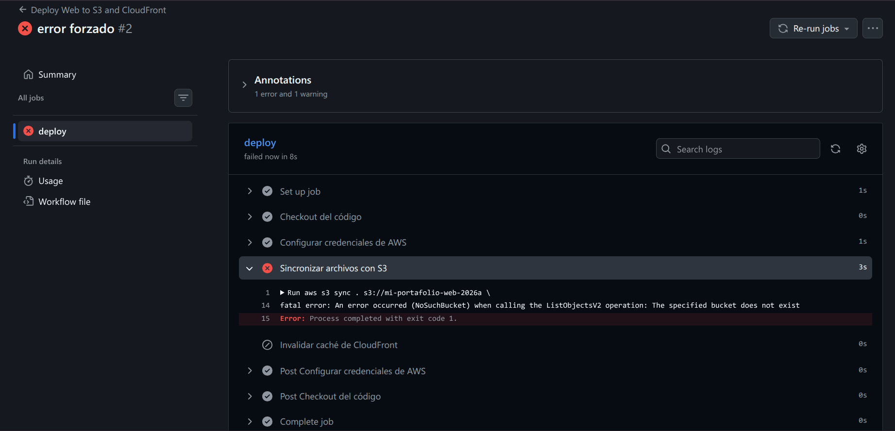
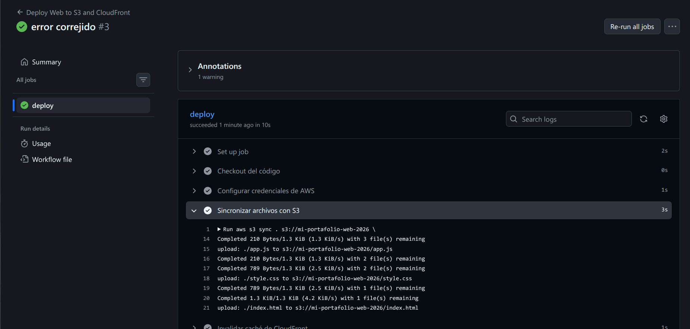
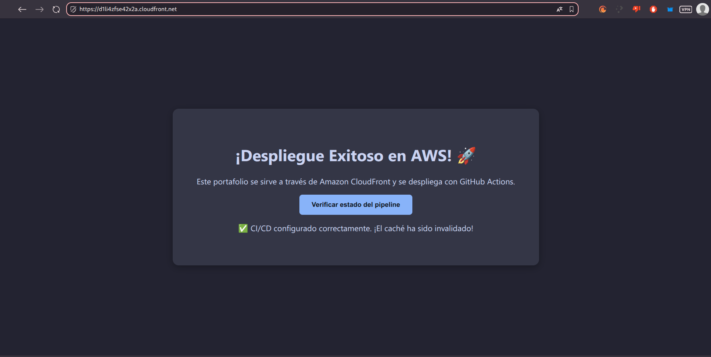

# Práctica Individual: Despliegue de una Aplicación Web Estática con CI/CD ☁️

**Universidad Mayor Real y Pontificia de San Francisco Xavier de Chuquisaca (USFX)**
**Carrera:** Ingeniería en Ciencias de la Computación  
**Materia:** COM610  
**Estudiante:** Peñaranda Villarroel Hernan Isaac  
**Docente:** Ing. Marcelo Quispe Ortega

---

## 1. Descripción del Proyecto
El proyecto consiste en una página web estática diseñada para funcionar como portafolio personal. El pipeline de CI/CD está automatizado a través de **GitHub Actions**. Al realizar un push en la rama `main`, el workflow se encarga de:
1. Autenticarse contra AWS mediante credenciales seguras (Secrets).
2. Sincronizar el contenido con un bucket **Amazon S3** (configurado con bloqueo de acceso público).
3. Ejecutar una invalidación de caché en **Amazon CloudFront** para reflejar los cambios globalmente de manera inmediata.

## 2. Acceso a la Aplicación
El sitio web está expuesto de forma segura mediante HTTPS a través de Amazon CloudFront. El bucket S3 original no permite acceso directo por políticas de OAC (Origin Access Control).

🌐 **URL Pública:** `https://d1li4zfse42x2a.cloudfront.net`

## 3. Evidencias y Capturas de Pantalla

### A. Bucket S3 Configurado

### B. CloudFront con Origin Access Control (OAC)

### C. Secretos y Variables en GitHub

### D. Ejecución de GitHub Actions

### E. Sitio Web en Producción

## 4. Conclusiones
Implementar CI/CD para un sitio web estático junto con CloudFront proporciona múltiples ventajas. Al usar **Origin Access Control**, aseguramos que los datos en S3 estén protegidos contra el acceso directo de usuarios no autorizados o ataques, canalizando todo el tráfico global mediante la CDN de AWS. GitHub Actions nos elimina la intervención manual de subir archivos, reduciendo el error humano, mientras que la regla de invalidación automática asegura que los usuarios reciban siempre el recurso más reciente (evitando problemas de "stale cache").